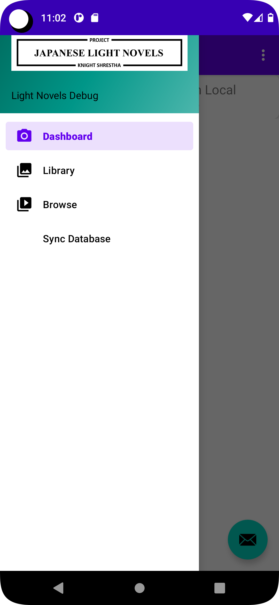
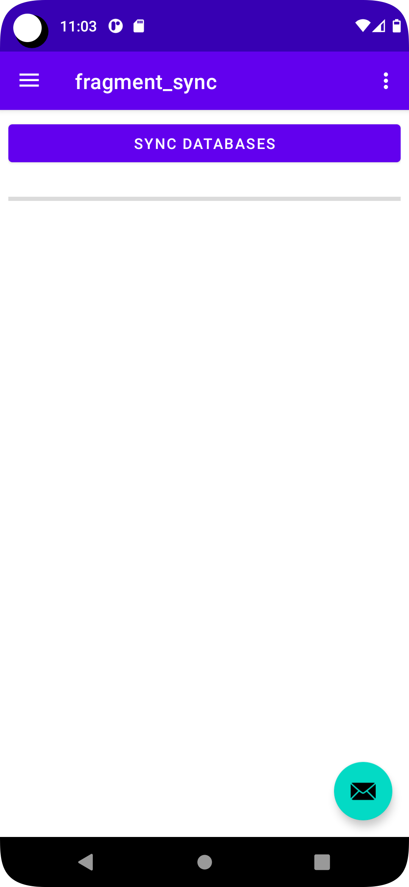

## 🎉 Changes 🎉

There has been a major update to the app that allows you to sync the remote and local databases. This new feature has been implemented to enhance data responsiveness by loading it locally, reducing the load on the data server.

To get started with the new feature, follow these steps:

1. Open the app.
2. Open the Navigation Drawer.
   

3. Click on the "Sync Database" option.

   

4. On the Sync Database screen, click the blue "Sync Databases" button. 💙

   

These improvements include clearer instructions, better use of headings, and properly aligned images. Enjoy syncing your databases with ease! 🎉 Let me know if there's anything else I can assist you with! 😊
